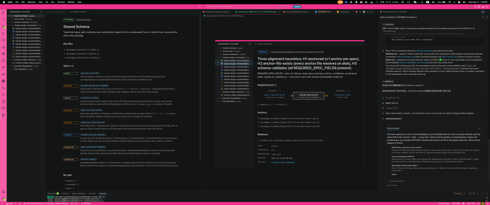
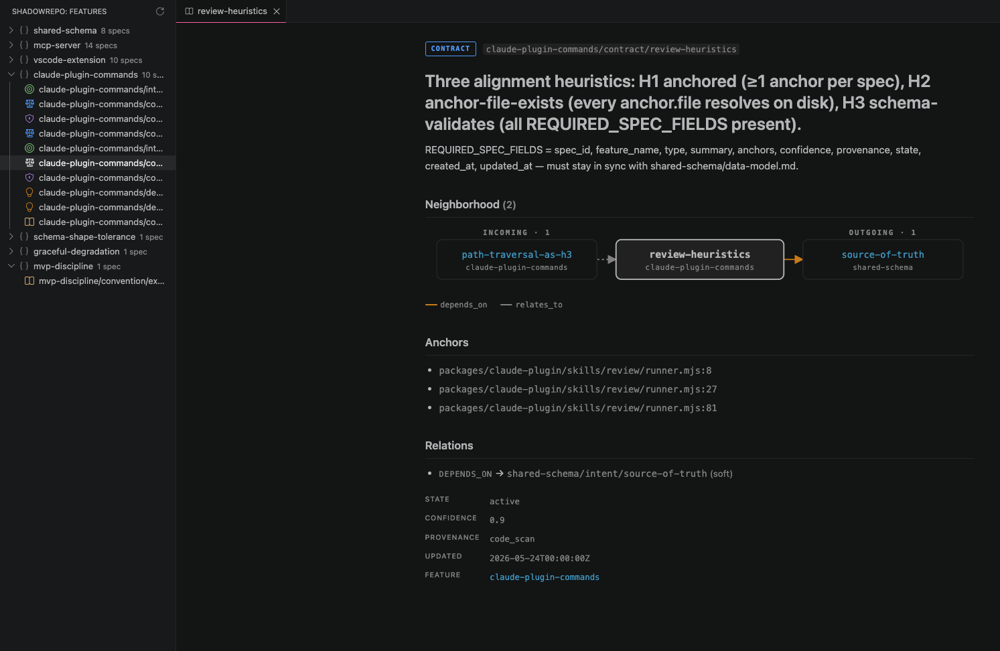

# DEMO — ShadowRepo

**Repository:** https://github.com/waynewangyuxuan/shadowrepo-extension-package
**VS Code Marketplace:** https://marketplace.visualstudio.com/items?itemName=waynewangyuxuan.shadowrepo-vscode
**npm:** https://www.npmjs.com/package/shadowrepo-mcp-server

> **Tooling scope:** assumes Claude Code + VS Code. Cursor, Codex, or other editors are not supported.

**Status:**
- ✅ Claude Code plugin — GitHub-based marketplace
- ✅ MCP server (`shadowrepo-mcp-server`) — npm, pulled via `npx`
- ✅ VS Code extension — VS Code Marketplace (also installable from source, see Build section)


*Sidebar tree (left), feature dossier (middle), spec dossier (right).*

---

## Install (no clone needed)

Requires Claude Code and Node.js 20+.

### Claude plugin

In any Claude Code session:

```
/plugin marketplace add waynewangyuxuan/shadowrepo-extension-package
/plugin install shadowrepo
/shadowrepo-build
```

| Command | What it does |
|---|---|
| `/shadowrepo-build` | Cold-start scan → write `.shadowrepo/*.json` |
| `/shadowrepo-check` | Flag drift between code and existing specs |
| `/shadowrepo-update` | Incremental updates (uses MCP server) |
| `/shadowrepo-render` | Generate HTML dashboard |
| `/shadowrepo-preview` | Quick preview |
| `/shadowrepo-review` | Pre-commit alignment report |
| `/shadowrepo-pr-comment` | Wrap `gh pr create --draft` with a ShadowRepo summary |

### VS Code extension

In VS Code: **Extensions panel → search `shadowrepo` → Install**. Or via CLI:

```bash
code --install-extension waynewangyuxuan.shadowrepo-vscode
```

Open any workspace that has a `.shadowrepo/` directory and click the ShadowRepo icon in the activity bar.

---

## Build from source

For contributors. Requires pnpm 9+ in addition to the above. Linux/WSL assumed.

### Build

```bash
git clone https://github.com/waynewangyuxuan/shadowrepo-extension-package.git
cd shadowrepo-extension-package
pnpm install
pnpm -r build
pnpm --filter shadowrepo-vscode package
```

Output: `packages/vscode-extension/shadowrepo-vscode-0.1.0.vsix`.

### Install your local build

```bash
code --install-extension packages/vscode-extension/shadowrepo-vscode-0.1.0.vsix
```

### Demo workspace

```bash
code fixtures/sample-repo
```

Click the **ShadowRepo** icon. Sidebar populates with 36 features / 629 specs.


*Click any spec for its full body, source anchors, and relations graph.*

> Fixture anchors are off-disk — clicks log a warning instead of opening the file. Tree itself is fully navigable.

### Run the pre-commit review (no Claude needed)

```bash
node packages/claude-plugin/skills/review/runner.mjs fixtures/sample-repo
```

Output: `fixtures/sample-repo/.shadowrepo/reviews/<ISO>.md`. On the bundled fixture: 629 files scanned, ~2183 findings.

### Optional: dry-run the PR-comment generator

```bash
node packages/claude-plugin/skills/pr-comment/runner.mjs fixtures/sample-repo \
  --summary-only --out /tmp/shadowrepo-pr-comment.md
```

Add `--dry-run --title "test" --base main` to print the `gh` commands without running them.

---

## Troubleshooting

- **`pnpm install` fails** — upgrade to Node 20+.
- **`code` not found** — install the `code` CLI via VS Code's command palette, or add `<vscode-install-dir>/bin/` to `PATH`.
- **Sidebar empty** — open `fixtures/sample-repo` as the workspace, not the repo root.
- **Anchor clicks warn** — expected on the fixture (off-disk paths).
- **`/plugin marketplace add` fails** — your Claude Code version may not support plugin marketplaces; check `claude --version`.
- **MCP commands fail** — verify `npx -y shadowrepo-mcp-server@latest` runs (should print `[shadowrepo-mcp-server] listening on stdio`).

## Not in this demo

- `/shadowrepo-pr-comment` real-run mode — would open a draft PR on the runner's GitHub.
