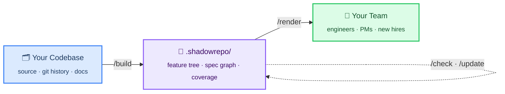
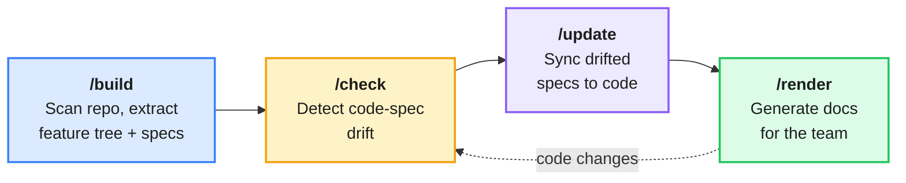

<p align="center">
  
  
  
  
</p>

<h1 align="center">ShadowRepo</h1>

<p align="center">
  <strong>A semantic knowledge graph for your codebase</strong><br>
  <sub>Extract the <em>why</em> behind code — not the what.</sub>
</p>

<p align="center">
  <a href="#quick-start">Quick Start</a> ·
  <a href="#commands">Commands</a> ·
  <a href="#what-it-produces">Output</a> ·
  <a href="#architecture">Architecture</a> ·
  <a href="#example">Example</a>
</p>

---

## The Problem

The decisions behind code — *why JWT over sessions? why this schema? why 5 pipeline stages?* — are scattered across PR threads, commit messages, and tribal knowledge. AI can read syntax, but **humans can't see the reasoning**.

ShadowRepo scans your repo, extracts structured semantic specs, organizes them into a feature tree, and detects when code drifts from those specs.



## Quick Start

ShadowRepo ships as a [Claude Code plugin](https://docs.claude.com/en/docs/claude-code/plugins). Two install paths:

**End users — install via marketplace** (recommended):

```
/plugin marketplace add waynewangyuxuan/shadowrepo-extension-package
/plugin install shadowrepo
```

**Contributors — local dev with live edits**:

```bash
git clone https://github.com/waynewangyuxuan/shadowrepo-extension-package.git
cd shadowrepo-extension-package
pnpm install && pnpm -r build
/plugin marketplace add ./           # in Claude Code, from the repo root
/plugin install shadowrepo
```

Then, in any project:

```
/shadowrepo-build
```

That's it. ShadowRepo scans your codebase and builds the knowledge graph.

## Commands

| Command | Purpose | When to use |
|:--------|:--------|:------------|
| `/shadowrepo-build` | Scan repo, build feature tree + spec graph | First time setup |
| `/shadowrepo-check` | Detect code-spec drift | After code changes |
| `/shadowrepo-update` | Fix drifted specs | When drift is found |
| `/shadowrepo-render` | Generate docs from specs | For onboarding, reviews |
| `/shadowrepo-help` | Show all capabilities | Anytime |

### Workflow



## What It Produces

All output lives in `.shadowrepo/` — plain JSON, git-diffable, zero dependencies.

```
.shadowrepo/
├── features.json          # Feature tree (product → domain → module)
├── specs.json             # Semantic specs with anchors + relations
├── coverage.json          # File-level spec coverage
└── meta.json              # Repo metadata + scan timestamp
```

## Example

Real output from scanning a social media monitoring pipeline:

<details>
<summary><b>Feature Tree</b> — hierarchical product decomposition</summary>

```json
{
  "feature_id": "pipeline",
  "name": "Filtering Pipeline",
  "type": "business",
  "description": "5-stage information filtering from social media firehose",
  "key_files": ["src/pipeline/orchestrator.py"],
  "parent": null
}
```

```json
{
  "feature_id": "pipeline/s2-embedding",
  "name": "Semantic Retrieval",
  "type": "business",
  "description": "Cosine similarity via text-embedding-3-small",
  "key_files": ["src/pipeline/s2_embedding.py"],
  "parent": "pipeline"
}
```

</details>

<details>
<summary><b>Spec</b> — a decision with anchors and relations</summary>

```json
{
  "spec_id": "pipeline/decision/recall-funnel-precision-at-s4",
  "feature_name": "pipeline",
  "type": "decision",
  "summary": "S1-S3 optimize for recall (don't lose relevant posts), S4 optimizes for precision (remove false positives).",
  "confidence": 0.9,
  "anchors": [
    { "file": "src/pipeline/s3_triage.py", "symbols": ["triage"] },
    { "file": "src/pipeline/s4_review.py", "symbols": ["review"] }
  ],
  "relations": [
    { "type": "depends_on", "target_spec_id": "core-ai/intent/litellm-abstraction" }
  ]
}
```

</details>

<details>
<summary><b>Feature → Spec hierarchy</b> — how it all connects</summary>

```
pipeline                              ← feature
├── decision/recall-over-precision    ← why: early stages keep all candidates
├── intent/multi-stage-filtering      ← why: progressive narrowing
├── constraint/5s-per-stage           ← why: SLA budget
│
└── s2-embedding                      ← sub-feature
    └── decision/drop-keyword-faiss   ← why: cosine similarity outperformed BM25
```

Every spec belongs to a feature. A feature owns files. Specs explain *why* those files exist.

</details>

> **A good spec captures why** — *"recall funnel because early stages shouldn't lose posts"*
> not what — *"pipeline has 5 stages"*.

## Architecture

No server. No dependencies. No scaffolding.

Skills are **natural language programs** that Claude executes using its native tools (Read, Grep, Glob, Bash, Write).

<table>
<tr>
<td><strong>Skills</strong><br/>Workflow logic</td>
<td><code>/build</code> · <code>/check</code> · <code>/update</code> · <code>/render</code> · <code>/preview</code></td>
</tr>
<tr>
<td><strong>Stdlib</strong><br/>Extraction methodology</td>
<td><code>methodology</code> · <code>data-model</code> · <code>quality-gates</code> · <code>recursion-engine</code> · <code>git-ops</code> · <code>file-discovery</code></td>
</tr>
<tr>
<td><strong>Contracts</strong><br/>JSON schemas</td>
<td><code>spec</code> · <code>feature</code> · <code>scope</code> · <code>check-result</code> · <code>merge-result</code></td>
</tr>
</table>

Core execution is **recursive** — sense → understand → extract → split → recurse → merge. The feature tree emerges bottom-up. Parallel agents write temp JSON; a synthesizer merges the results.

## Design Principles

| Principle | What it means |
|:----------|:--------------|
| **Density over coverage** | ~150–200 high-quality specs per medium repo, not thousands of shallow ones |
| **Tree, not flat list** | Features form a hierarchy (product → domain → module), enabling drill-down |
| **Transparent** | Every extraction step is visible; users can intervene and guide |
| **Idempotent** | Running `/build` twice produces the same result |
| **Zero infrastructure** | JSON files in your repo, committed alongside your code |

## Uninstall

Marketplace install:

```
/plugin uninstall shadowrepo
```

Contributor (dev) install — removes the `claude-sr` alias and any legacy skill symlinks left over from pre-plugin installs:

```bash
./dev-install.sh remove
```

---

<p align="center">
  <sub>Built as a Claude Code Plugin · No servers, no dependencies, just specs</sub>
</p>
